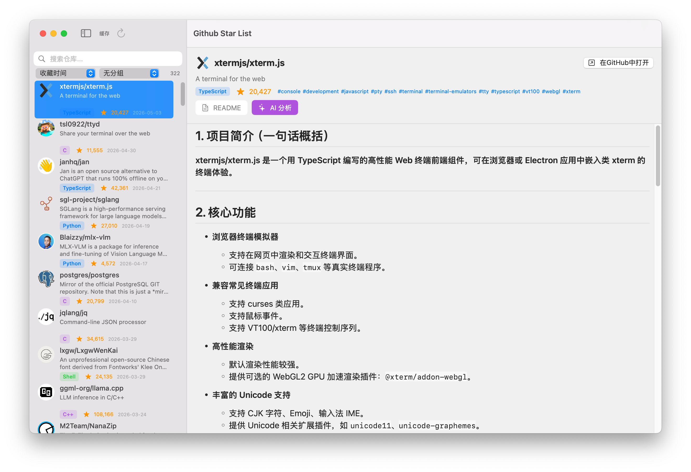
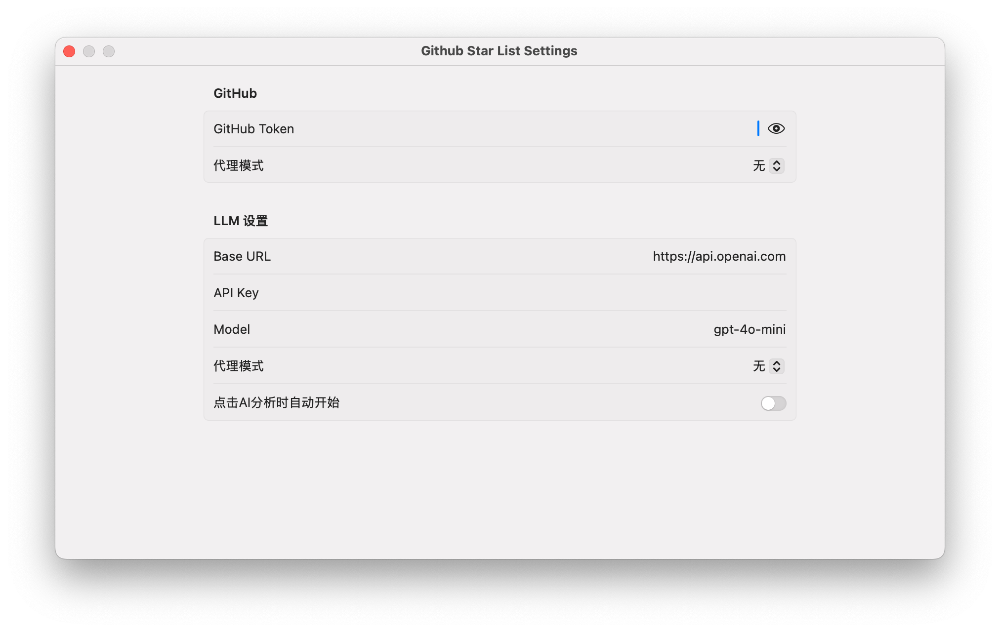

# SwiftStarList

由 [OpenCode](https://opencode.ai) / [GLM-5.1](https://zhipuai.cn) Vibe Coding 而成

一款 macOS 原生 GitHub Star 管理工具，支持 AI 智能分析。

## 功能

- 浏览所有 GitHub Star 仓库，支持按语言/标签/描述搜索
- 查看仓库 README（Markdown 渲染）
- AI 分析仓库摘要与技术栈（OpenAI 兼容 API）
- 支持代理配置（HTTP/SOCKS5/系统代理）
- 仓库头像与数据本地缓存

## AI 分析



## 使用前设置

首次使用前，请先在设置中配置 GitHub Token 和 LLM 信息：



## 构建

```bash
# SPM
swift build
swift run

# Xcode
xcodebuild -scheme SwiftStarList build
# 或双击 SwiftStarList.xcodeproj
```

## 依赖

- [MarkdownUI](https://github.com/gonzalezreal/swift-markdown-ui) - Markdown 渲染

## License

[MIT](LICENSE) © 2026 0x574859
